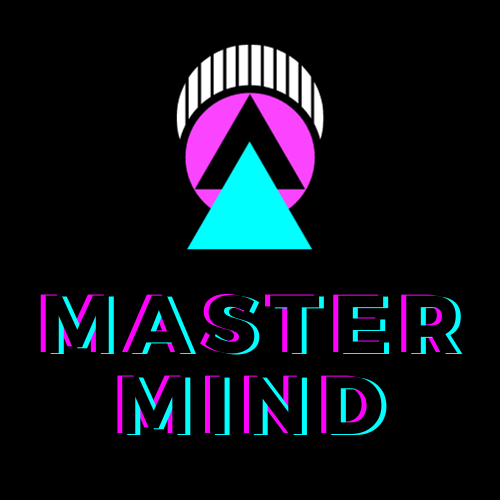

El jugador debe elegir 5 colores, todos ellos deben ser diferentes y ninguno podrá ser el negro. El objetivo del juego es adivinar el orden correcto de estos colores, teniendo en cuenta que la solución esta compuesta de 4 colores; para ello dispondrá de 10 intentos.
Cada vez que el jugador pruebe con una combinación, el juego proporciona pistas mediante fichas de colores. El color blanco se utiliza para indicar que la posición elegida es correcta, el color azul se utiliza para indicar que la posisición no es correcta pero si forma parte de la solución; mientras que el rosa indica que el color es incorrecto.
El juego se da por finalizado cuando el número de intentos haya terminado o se averigüe el orden correcto de colores.

# Tecnologias Utilizadas

- HTML
- CSS
- JavaScript
- Bootstrap
- Canva

# Elementos del Juego

### Instrucciones

En la página de "Ayuda" encontramos las reglas del juego, donde se especifica cómo el jugador debe elegir su combinación de colores y la metodología que se utiliza para la corrección. En la parte inferior aparecen dos botones donde nos redirige a el inicio o a el juego.

### Datos del Jugador

La vista de "Datos" es donde el jugador debe indicar su nombre y la elección de 5 colores, asegurándose de que no aparezca el color negro y que todos sean diferentes. Si alguno de estos campos no está rellenado, el juego mostrará una alerta en la parte superior indicando que es necesario completarlos. En la parte inferior, se encuentran dos botones; uno te redirige al inicio del juego y el otro al inicio del juego.

### Juego

¡Aquí comienza el juego! En la parte izquierda, encontrarás el nombre del jugador, su selección de colores y dos botones: uno para mostrar las reglas y otro para volver a la pantalla de datos del jugador. En la parte derecha, está el tablero del juego. Cada casilla cuadrada se llenará cuando el jugador haga clic en uno de los colores. Una vez que se llenen las cuatro casillas, automáticamente se rellenarán los círculos con pistas para adivinar la combinación correcta.

### Ganador

Cuando el jugador haya adivinado correctamente la combinación de colores y aparezcan los cuatro círculos en blanco, la pantalla de ganador se mostrará automáticamente. En esta vista, se le preguntará al jugador si desea jugar de nuevo o no.

### Perdedor

Cuando el jugador haya agotado sus 10 intentos sin adivinar la combinación correcta de colores, se mostrará automáticamente esta pantalla. En la parte inferior, aparecen dos botones que preguntarán al jugador si desea jugar nuevamente o no.

# Contacto

- **Dirección:** Edificio Talent Garden. Calle de Juan de Marina 15, Madrid.
- **Teléfono:** +34 123-456-789
- **Sitio Web:** https://github.com/SandraSuazo/Proyecto3-MasterMind
